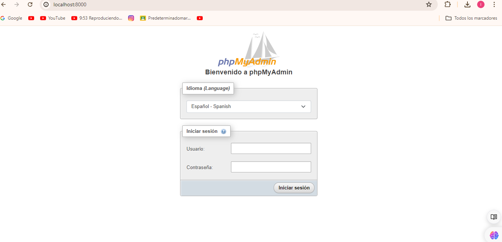

# Trabajo Práctico N°3
1a) Archivo "sinhilos.py": Se ejecutó en un tiempo de 5,242...
    Se puede ver que el tiempo en cada una de las ejecuciones puede llegar a variar ligeramente.

1b) EJEMPLO:Cuando se quiere comprimir una carpeta grande de fotos para enviarla por ejemplo, por correo electrónico, la velocidad de este proceso será mucho más rápida si usas una computadora con un procesador potente y mucha memoria RAM, en comparación con una computadora más antigua y lenta. En este caso, el tiempo que tarda en comprimir el archivo depende de las capacidades de la computadora que estés usando.

1c) EJEMPLO: Llamar a tu compañía de internet porque hay problemas de conexión. Aunque tu teléfono sea rápido, la rapidez con la que avanzas en el sistema de voz automático y cuánto tiempo tardas en hablar con un empleado no solo dependen de lo bueno que sea tu teléfono. También se ven afectados por cuántas personas estén llamando en ese momento, qué tan ocupado esté el sistema y otros factores fuera de tu control. Así que incluso si tienes un teléfono super rápido, podrías tener que esperar un poco antes de que alguien pueda ayudarte.

2a)Para ejecutar las tres tareas simultáneamente, el tiempo total de ejecución se reduce significativamente.Lo que lleva a una ejecución más eficiente del programa en general.

b)Las funciones no siempre completan su ejecución en el mismo orden en que se iniciaron. Esto se debe a que se están ejecutando en subprocesos diferentes y el sistema operativo decide cuál ejecutar en cada momento.

c)EJEMPLO: Descargando archivos de Internet. Con un solo hilo, solo puedes descargar un archivo a la vez, lo que puede llevar mucho tiempo si hay muchos archivos grandes. Pero con hilos múltiples, puedes descargar varios archivos al mismo tiempo, lo que acelera todo el proceso.

3a)El tiempo de respuesta mejora considerablemente, lo que lleva a una ejecución más eficiente del programa en general.

3b)El valor final del acumulador cambia  cada vez que se ejecuta el programa.

3c)Se debe a que dos partes del programa intentan cambiar el valor del acumulador al mismo tiempo, y a veces una parte puede modificarlo antes que la otra, lo que hace que el resultado final varíe.

4a)Con el uso del lock, se evita que los hilos 1 y 2 modifiquen la variable global acumulador al mismo tiempo. Asi,el valor final del acumulador será más  predecible en cada ejecución del código.

b)El lock permite que  los subprocesos trabajen juntos sin interferirsey de esta forma se acelera el tiempo de ejecución.

# Trabajo Practico N°4

